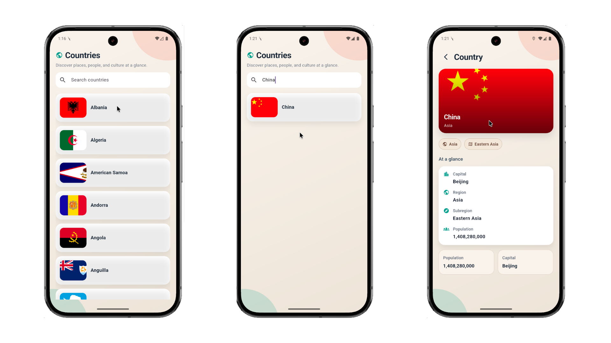
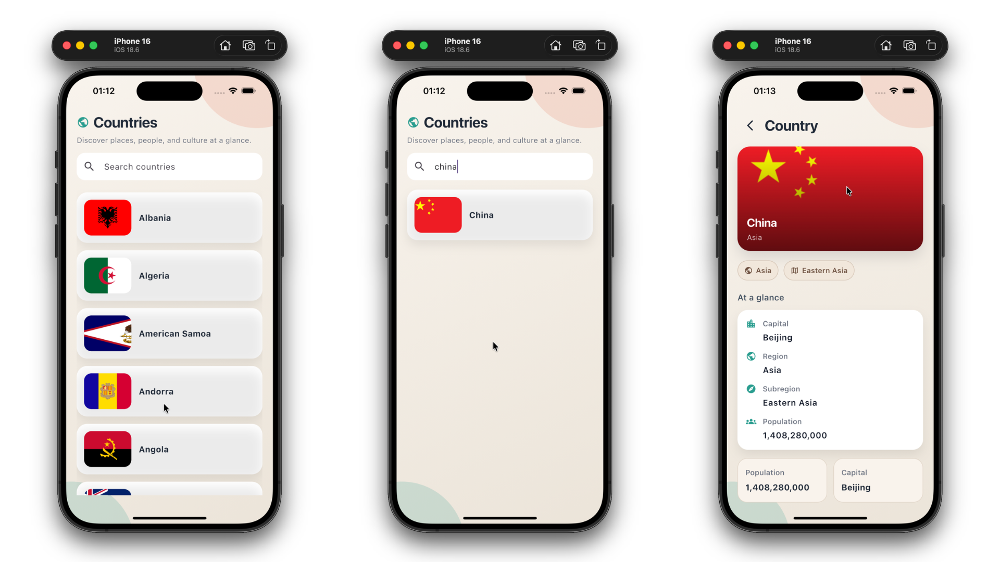

# Country List App

This Flutter project was built as a mobile engineering principles assessment.
It fetches countries from the REST Countries API, shows a searchable list with
flags, and opens a detailed country screen on tap.

## Tech Stack

- Flutter
- Riverpod (state management)
- HTTP (REST API)
- build_runner and riverpod_generator

## Assessment Coverage

- Country List Screen using `ListView` with country name and flag
- Country Details Screen with capital, population, region, and subregion
- Client-side search filtering on the loaded data
- Navigation from list to details
- Basic styling for a clean, modern UI

## Architecture

The project follows a feature-first, layered architecture:

- data: remote datasource, models, repositories
- presentation: screens and viewmodels
- core: shared widgets and error handling

This keeps API access, state management, and UI concerns separated while still
staying lightweight and easy to maintain.

## Setup

1. Install Flutter and Dart.
2. Run `flutter pub get`.
3. Run `dart run build_runner build --delete-conflicting-outputs`.
4. Start the app with `flutter run`.

## What This Demonstrates

- Riverpod async state with a repository pattern
- REST API integration using a datasource layer
- Client-side search without extra network calls
- Simple list/detail navigation with clean separation of concerns

## Screenshots

Android:

iOS:

